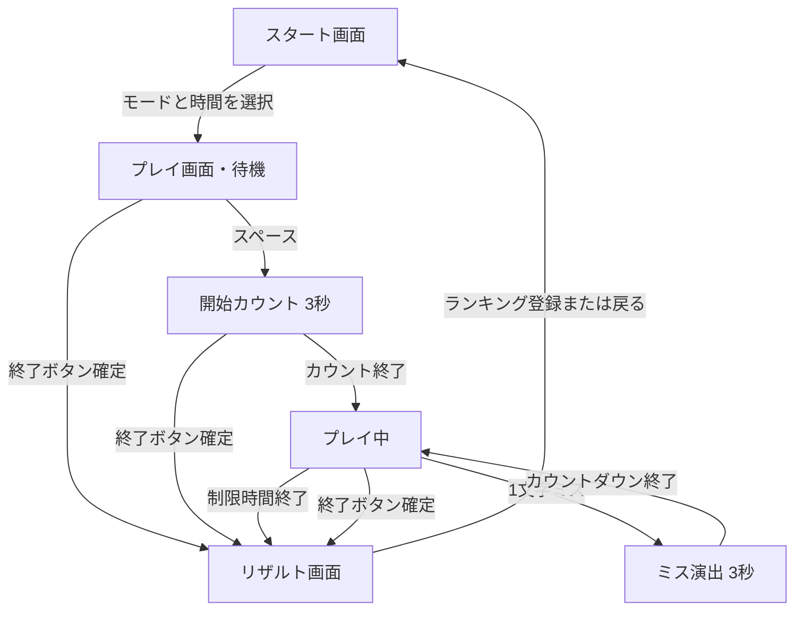

# タイピングアプリ MVP 仕様書

| 項目 | 内容 |
| --- | --- |
| 対象 | Web ブラウザ上で動作するタイピングゲーム |
| 版 | MVP 1.0（仕様草案） |
| スコープ外 | 技術スタック選定、実装方式、インフラ詳細 |

本文中の「補完事項」は、元の要求に明示されていなかった細部を MVP として確定した定義である。実装時は本仕様を正とする。

---

## 1. 概要

制限時間内に課題文を打ち続け、スコアを競うタイピングゲーム。

- **長文モード**: 日本語（30〜60 文字程度）をローマ字入力する
- **コーディングモード**: よく使うコード 1 行を、表示どおりに入力する

各モードで制限時間は **3 分** または **5 分** を選ぶ。1 文字でも間違えるとその文は最初からやり直し（3 秒のペナルティ演出あり）。終了後に詳細スコアを表示し、部門別ランキングに登録できる。

---

## 2. 画面一覧

| 画面 | 役割 |
| --- | --- |
| スタート画面 | サイト説明、モード×時間の選択、ブラウザの表示名設定、ランキング表示 |
| プレイ画面 | タイピング本編。HUD・演出・課題文・仮想キーボード。開始前は待機（課題文は非表示） |
| リザルト画面 | プレイ結果の一覧表示、ランキング登録 |
| 開始カウント（オーバーレイ） | スペース後の 3 秒カウントダウン。独立画面ではない |
| ミス演出（オーバーレイ） | プレイ画面上に重ねる 3 秒カウントダウン。独立画面ではない |

ランキングはスタート画面内のパネルとして表示する。専用の独立ページは MVP では作らない。

---

## 3. 画面遷移

- モード選択ではプレイ画面へ移動するだけ。この時点ではタイマーは動かず、入力も判定しない。
- プレイ画面でスペースを押すと 3 秒カウント（3→2→1）のあと、タイマー開始・入力受付開始。カウント中のスペース再押下ではスキップしない。待機中と開始カウント中は課題文（日本語・ふりがな・ローマ字）と出典を出さず、カウント終了後に表示する。
- 開始トリガーのスペースと、長文プレイ中のスペース無視は別である。コーディングのスペースはゲーム開始後のみ判定する。
- 「終了」は開始前・開始カウント中・プレイ中のいずれでも確認ダイアログを出し、確定した場合のみリザルトへ進む。
- ミス演出中は入力を受け付けない。3 秒後、同じ課題文を先頭からやり直す。

---

## 4. モード仕様

### 4.1 共通

| 項目 | 内容 |
| --- | --- |
| 制限時間 | 3 分（180 秒）または 5 分（300 秒） |
| タイマー | 残り時間のカウントダウン。0 になった瞬間にプレイ終了 |
| 課題の供給 | 制限時間中、打ち終えるたびに次の課題文を出す |
| 同一文の再出題 | 直近に出した文は連続で出さない |

### 4.2 長文モード

| 項目 | 内容 |
| --- | --- |
| 課題 | 日本語 1 文。目安 30〜60 文字 |
| 終端 | 文は「。」までを 1 課題とする |
| 入力方式 | ローマ字入力（画面上は日本語原文とローマ字の 2 段表示）。し/shi・si、ふ/fu・hu、じ/ji・zi、を/wo・o、は/ha・wa など一般的な別表記を許可し、表示ローマ字は選んだ経路に合わせて更新する。初期表示の canonical は「を」= wo、「は」= ha。単語間スペースは表示してよいが入力では要求せず、スペースキーはミスにしない |
| ふりがな | 漢字の上にのみ、その文での読みをひらがなで示す（HTML ruby）。送り仮名・ひらがな・カタカナ・句読点には付けない。音訓と送り仮名を取り違えず、漢字に送り仮名の読みを重ねない。コーディングモードには付けない |
| 出典 | 日常会話由来なら「日常会話より」。外部参照なら「（参照元）より」 |
| 課題例の方針 | 日常で使う文、または有名な本・物語などからの引用 |

表示上の日本語 1 文字（句読点「。」を含む）を正しく打ち終えたとき、その文字が「打てた」とみなされる。ローマ字の途中入力だけでは加点しない。

### 4.3 コーディングモード

| 項目 | 内容 |
| --- | --- |
| 課題 | よく使う 1 行のコード片 |
| 言語 | HTML / CSS / JavaScript / Java / C# / C++ |
| 入力方式 | 表示文字列をそのまま入力（必要な空白も含む） |
| 出典 | 「HTMLより」「JavaScriptより」のように言語名を表示 |

言語は課題ごとに切り替えてよい。特定言語に偏りすぎないよう、出題プールを各言語から用意する。

---

## 5. 入力・ミス仕様

### 5.1 正しい入力

- 長文モードは、かな（segment）単位で複数のローマ字経路のうちいずれかの次キーと一致すれば正解とする。表示中のローマ字とハイライトは、ユーザーが選んだ経路に合わせて更新する。表示用の空白は自動で進めて打った扱いにし、スペースキーは無視する（ミスにしない）。
- コーディングモードは、表示文字列どおりの 1 文字と一致したキー入力だけを正解とする。空白も入力必須。
- 正解時、カーソルを 1 文字進める。
- Shift が必要な記号は、その記号として正しければ正解（左右 Shift の区別はしない）。

### 5.2 ミス

1 文字でも間違えると、次をすべて行う。

1. 誤タイプ数を +1 する
2. 減点する（長文 −500pt、コーディング −300pt）
3. コンボを 0 に戻す
4. 画面全体を赤くする
5. 画面中央最前面に 3 秒のカウントダウンを出す
6. 数字の周りに、開始までの残り時間を示す円（リング）を表示する
7. 3 秒後、その課題文を先頭からやり直す（途中まで打てていた進捗は捨てる）
8. やり直した文は、その周回では Perfect 対象にならない

ミス演出中はキー入力を無視する。カウントは 3 → 2 → 1 の整数表示とする。

### 5.3 制限時間終了

- 入力途中の文があっても打ち切る。
- その文の完走ボーナス・Perfect ボーナスは入らない。
- すでに確定した文字加点・減点・完走分は残す。
- リザルト画面へ遷移する。

### 5.4 終了ボタン

- 画面右上、合計スコアの上に置く。
- 押すと確認（例: 「プレイを終了しますか？」）を出す。
- 確定したら制限時間終了と同じ扱いでリザルトへ進む。

---

## 6. スコア仕様

### 6.1 長文モード

| 契機 | 点数 | 倍率 |
| --- | --- | --- |
| 日本語 1 文字を正しく打ち終えた | +100pt | あり |
| 文を最後（「。」）まで打ち終えた | +1000pt | あり |
| その文をノーミスで打ち終えた（Perfect!） | さらに +1000pt | あり |
| 1 文字ミス | −500pt | なし |

### 6.2 コーディングモード

| 契機 | 点数 | 倍率 |
| --- | --- | --- |
| 1 文字を正しく打った（空白含む） | +50pt | あり |
| 行を最後まで打ち終えた | +1000pt | あり |
| その行をノーミスで打ち終えた（Perfect!） | さらに +1000pt | あり |
| 1 文字ミス | −300pt | なし |

### 6.3 コンボと倍率

コンボは「連続で課題を打ち終えた回数」である。

| コンボ | 加点倍率 |
| --- | --- |
| 0（開始時・ミス直後） | ×1.0 |
| 1 | ×1.1 |
| 2 | ×1.2 |
| 3 | ×1.3 |
| 4 | ×1.4 |
| 5 以上 | ×1.5（上限） |

補完事項:

- 文（行）を 1 つ完走するたびにコンボを +1 する。
- 加点が発生した時点のコンボ数で倍率を掛ける。
- 完走ボーナスと Perfect ボーナスは、その完走で増えた**後**のコンボ数で計算する。
- 文字ごとの加点は、直前までに確定しているコンボ数で計算する（その文を打っている最中はコンボは増えない）。
- 減点に倍率は掛けない。
- スコアは整数に四捨五入する。
- 合計スコアの下限は 0 とする（マイナスにはしない）。

計算例（長文、コンボ 0 から 1 文をノーミス完走、原文 40 文字）:

- 文字加点: 40 × 100 × 1.0 = 4000
- 完走後コンボ 1: 完走 1000 × 1.1 = 1100、Perfect 1000 × 1.1 = 1100
- この文の合計: 6200

### 6.4 リザルト表示項目

両モード共通。プレイ終了時に次を表示する。

| 項目 | 定義 |
| --- | --- |
| 合計スコア | 最終スコア |
| 最大コンボ数 | そのプレイ中のコンボ最大値 |
| Perfect数 | ノーミス完走した課題数 |
| 打った文字数（入力文字数） | 正タイプ数 + 誤タイプ数 |
| 正しく打てた数（正タイプ数） | 正解と判定された入力回数 |
| 間違えた数（誤タイプ数） | ミスと判定された入力回数 |
| 正タイプ率 | 入力文字数が 0 なら 0%。それ以外は 正タイプ数 ÷ 入力文字数 × 100（小数第 1 位） |
| 誤タイプ率 | 入力文字数が 0 なら 0%。それ以外は 誤タイプ数 ÷ 入力文字数 × 100（小数第 1 位） |

長文モードの正タイプ数は、ローマ字キーとしての正解回数とする（日本語 1 文字分のローマ字が複数キーなら、そのキー数だけ数える）。コーディングモードは表示文字 1 つにつき 1 回。

---

## 7. ランキング仕様

機能要件のみ定義する。ホスティングや実装手段の詳細はスコープ外。希望基盤は Cloudflare、困難な場合は Firebase。

### 7.1 部門

次の 4 部門。各部門は独立した上位 10 人のリストを持つ。

| 部門 | モード | 時間 |
| --- | --- | --- |
| 長文 3 分 | 長文 | 3 分 |
| 長文 5 分 | 長文 | 5 分 |
| コーディング 3 分 | コーディング | 3 分 |
| コーディング 5 分 | コーディング | 5 分 |

### 7.2 表示ルール

- 各部門ともスコア降順の上位 10 件を表示する。
- 同点は先に登録された方を上位とする。
- 自分の今回スコアが 11 位以下、または未登録のプレビュー表示では、上位 10 件の下に「ランク無し」として自分のスコアを出す。
- 表示項目は順位・名前・スコアとする。

### 7.3 登録

補完事項:

- 表示名はブラウザ（匿名 ID）につき 1 つ。スタート画面で設定・変更する。
- 名前は 1〜12 文字。未設定・空は「ゲスト」。12 文字を超える名前は受け付けない。
- 名前を変更したら、その匿名 ID の登録済み結果の表示名をすべて更新する。
- リザルト画面ではスタートで決めた表示名で登録する。プレイごとに別名は付けない。
- 不適切な文字列の拒否は MVP では最低限（空は「ゲスト」、12 文字超は拒否）でよい。
- 同じプレイ結果の二重登録はしない。
- 登録は任意。登録せずスタート画面に戻れる。

---

## 8. スタート画面の要件

- サイトの説明（何をするゲームか、2 モードがあること、ミスするとやり直しになること）
- ブラウザごとの表示名設定（画面右上。未設定は「ゲスト」）
- モード選択
  - 長文モード: 3 分 / 5 分
  - コーディングモード: 3 分 / 5 分
- ランキング表示（4 部門を切り替えて見られること）

選択したモードと時間でプレイ画面へ進む。この時点では開始せず、プレイ画面のスペースで開始カウントに入る。

---

## 9. UI / UX 要件

全体トーン（選定前の共通制約）:

- ゲームのようなデザイン
- 黒、または濃いめの紺をベースにする
- ネオンを使う
- 演出・エフェクトを多めにする

方向性の具体案（案 A / B / C）はモックで比較し、選定後に「11. 決定した方向性」へ記入する。

### 9.1 プレイ画面レイアウト

| 位置 | 要素 |
| --- | --- |
| 画面左上 | 残り時間タイマー |
| 画面右上 | 終了ボタン。その直下に合計スコア |
| 画面中央・上寄り | 課題文（日本語またはコード）。開始前・開始カウント中は非表示 |
| 課題文の直下 | ローマ字（長文モード）。コーディングモードでは入力対象のコード列を兼ねてよい |
| 課題文付近 | 出典（「日常会話より」「（参照元）より」「HTMLより」など）。開始前は非表示 |
| 画面中央・下 | 仮想キーボード。実キー押下と連動して光る。次キーの黄ハイライトは開始後 |
| 画面右・下寄り | コンボ表示 |
| 課題文付近（開始前のみ） | 「スペースを押してスタート」の短い案内 |

### 9.2 課題文・ローマ字の文字色

両段とも同じ規則。

| 状態 | 見た目 |
| --- | --- |
| まだ打っていない文字 | 白 |
| いま打つべき文字 | 光らせる（ネオン発光） |
| すでに打った文字 | 灰色 |

### 9.3 スコア演出

- 右上に合計スコアを常時表示する
- 加点時: 「+○○pt」を虹色で 1 秒表示し、短いフェードアウトで消す
- 減点時: 「−○○pt」を赤色で 1 秒表示し、短いフェードアウトで消す
- 「○○」は実際に増減した点数（倍率適用後）

### 9.4 開始カウント / ミス演出

開始カウント:

- 案 A のネオン（シアン／マゼンタ）で、画面中央最前面に 3→2→1 の数字とリングを出す
- カウント前のみ「スペースを押してスタート」を出す

ミス演出:

- 画面全体を赤くする
- 画面中央の最前面にカウントダウン数字を出す
- 数字の周りに、開始までの残り時間を示す円を出す

### 9.5 コンボ演出

- コンボ中のみ、現在のコンボ数（数字）と、少し離して「コンボ」と表示する
- コンボ 0 のときは数字と「コンボ」を出さない（または十分に抑える）
- 数字だけに火のエフェクトを付ける。「コンボ」ラベルには付けない
- 火のエフェクトはコンボが増えるほど大きく、豪華にする
- 表示はほんの少し傾ける
- 太く大きいフォントで目立たせる
- コンボが増える瞬間、数字だけを一瞬膨らませる

### 9.6 Perfect 演出

- ノーミス完走時、コンボ表示の上に「Perfect!」を虹色で 1 秒出し、フェードアウトで消す

### 9.7 タイマー演出

- 通常時は視認しやすい表示
- 残り 10 秒から、数字が減るたびに赤く膨らませて目立たせる

### 9.8 仮想キーボード

- 画面中央下に QWERTY 配列を表示する
- プレイヤーが押したキーに対応するキーキャップを光らせる
- ミス時も押したキーは一瞬反応してよいが、直後にミス演出が優先される

### 9.9 リザルト画面

- 6.4 の全項目を一覧表示する
- スタートで決めた表示名の確認とランキング登録、スタートへ戻る操作を置く
- プレイ画面と同じトーンを維持する

---

## 10. 補完事項一覧

元要求に無く、本仕様で決めた項目。

1. コンボ倍率は 1 コンボごとに +0.1。5 コンボ以上は ×1.5 で打ち止め。
2. コンボ 0 の倍率は ×1.0。
3. ミス時はコンボを 0 に戻す。
4. 減点に倍率は掛けない。
5. 合計スコアの下限は 0。加点は四捨五入して整数にする。
6. 文字加点は「完走前のコンボ」、完走/Perfect は「完走後のコンボ」で倍率する。
7. ミスした周回の文は Perfect にならない。やり直し後にノーミスでも、その周回は Perfect 対象外。
8. 制限時間 0 または終了確定時は、途中の文を捨ててリザルトへ進む。
9. 終了ボタンは確認ダイアログを出す。
10. 表示名はブラウザにつき 1 つ。スタート画面で設定。空は「ゲスト」。1〜12 文字。変更時は登録済み結果をすべて更新。
11. 同じ結果の二重登録はしない。登録は任意。
12. 同点は先登録を上位とする。
13. 正タイプ率・誤タイプ率は小数第 1 位。入力 0 回はともに 0%。
14. 長文の正タイプ数はローマ字キー単位。
15. ランキングはスタート画面内表示とし、独立ページは作らない。
16. ミス演出中は入力不可。
17. 直近と同じ課題文は連続で出さない。
18. 長文の初期表示は「を」= wo、「は」= ha。入力はを=wo/o、は=ha/wa を許可する。
19. 長文の単語間スペースは表示のみ。入力では要求せず、スペースキーは無視する。コーディングの空白は入力必須。
20. 長文の課題文は漢字にだけふりがな（ひらがな）を付ける。コーディングモードには付けない。
21. モード選択後は待機。スペースで 3 秒カウントしたあとタイマーと入力を開始する。待機中と開始カウント中は課題文を表示しない。
22. 開始カウント中は入力不可。スペース再押下でのスキップはしない。
23. 終了ボタンは開始前・開始カウント中でも確認後にリザルトへ進める。

---

## 11. 決定した方向性

**採用: 案 A「サイバーパンク・アーケード」**

3 案の HTML モック（スタート + プレイ）を比較し、案 A を採用する。実装時の見た目は `mockups/a/start.html` と `mockups/a/play.html` を基準にする。

### 11.1 トーン

- ゲームのアーケード筐体を意識した、派手で発光の多い画面
- ベースは濃紺〜ほぼ黒（`#050814` 前後）
- アクセントはシアン（`#00f6ff`）とマゼンタ（`#ff2ec8`）。補助にバイオレット
- ネオン縁、格子背景、薄いスキャンラインを使う
- 演出量は 3 案のうち最も多い方向を維持する（グロー、点滅、スコア虹色、コンボの炎）

不採用案の扱い:

- 案 B の夕日・遠近グリッド・レトロ見出しは使わない
- 案 C のライム配色と角フレーム HUD は使わない

### 11.2 配色

| 用途 | 色 |
| --- | --- |
| 背景 | 濃紺 `#050814`。マゼンタ／シアンの弱い放射グラデを重ねてよい |
| パネル | 半透明の暗い紺。シアン枠、弱いマゼンタの内グロー |
| 主アクセント | シアン `#00f6ff`（選択、現在文字、キー発光、順位） |
| 副アクセント | マゼンタ `#ff2ec8`（時間、終了ボタン、OUT OF RANK） |
| 未入力文字 | 白 |
| 入力済み文字 | 灰 `#6d7b96` 前後 |
| 現在文字 | シアン発光。マゼンタの二次グロー可 |
| 減点・ミス・残り10秒 | 赤 `#ff3b5c` 前後 |
| 加点ポップ | 虹色グラデーション |
| コンボ数字 | 暖色〜白。炎はオレンジからマゼンタ |

### 11.3 タイポグラフィ

- 英数字・スコア・タイマー・見出し: Orbitron（太め、字間広め）
- ローマ字・キーキャップ: Rajdhani
- 日本語本文: Zen Kaku Gothic New または同等のゴシック

### 11.4 スタート画面

- 大きなロゴ見出し（例: NEON TYPE）。サイト説明と短い特徴チップ
- 右上（ランキングの上）にブラウザの表示名設定
- モード選択は 2×2 のカード。各カードにモード名、短い説明、右上に 3:00 / 5:00
- ランキングは右（狭幅では下）のパネル。4 部門タブ + 上位 10 + 圏外行
- カードホバーでシアンの発光とわずかな浮き

### 11.5 プレイ画面

- 左上タイマー、右上終了ボタン、その下に SCORE
- 中央上寄りに出典チップ、日本語課題（漢字にふりがな）、その下にローマ字
- 中央下に仮想キーボード。押下キーはシアンで強く光る
- 右下寄りに傾けたコンボ。数字のみ炎。コンボ 0 では数字も「コンボ」も出さない
- 左下の演出確認ボタンはモック専用であり、製品には置かない

### 11.6 演出量

派手寄りで固定する。抑制しない。

- 背景グリッド + スキャンラインは常時
- 現在文字は点滅しつつネオン発光
- 加点は虹色 1 秒 + フェード。減点は赤 1 秒 + フェード
- コンボ増加で数字が膨らむ。5 コンボ以上で炎と数字を一段大きくする
- Perfect! はコンボの上に虹色 1 秒
- ミスは画面全体の赤転 + 中央カウントと円リング
- 残り 10 秒はタイマーが減るたびに赤く膨らむ
